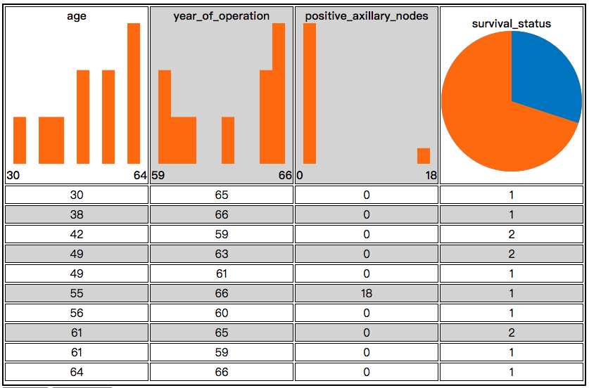

# chart-table
Clickable table with charts in thead tag. 

# Setup

Include the library

```html
<script src="dist/charttable.min.js"></script>
<link rel="stylesheet" href="dist/charttable.min.css" />  
```

## CDN - UNPKG
* TODO

# Usage
## Hello World example
Create an element to hold the table

```html
<div id="target"></div>
```

Turn the element into a table with some simple javascript

```javascript
var mytable = charttable.table();
mytable.initTbl(document.getElementById("target"));
mytable.showDataset([
  {sepal_length: 5.1, sepal_width: 3.5, petal_length: 1.4, petal_width: 0.2, species: 'Setosa'},
  {sepal_length: 4.6, sepal_width: 3.1, petal_length: 1.5, petal_width: 0.2, species: 'Setosa'},
  {sepal_length: 4.9, sepal_width: 3.1, petal_length: 1.5, petal_width: 0.2, species: 'Setosa'},
  {sepal_length: 4.4, sepal_width: 3.2, petal_length: 1.3, petal_width: 0.2, species: 'Setosa'},
  {sepal_length: 4.8, sepal_width: 3, petal_length: 1.4, petal_width: 0.3, species: 'Setosa'},
  {sepal_length: 4.9, sepal_width: 2.4, petal_length: 3.3, petal_width: 1, species: 'Versicolor'},
  {sepal_length: 6.7, sepal_width: 3, petal_length: 5, petal_width: 1.7, species: 'Versicolor'},
  {sepal_length: 5.5, sepal_width: 2.4, petal_length: 3.7, petal_width: 1, species: 'Versicolor'},
  {sepal_length: 6.4, sepal_width: 3.2, petal_length: 5.3, petal_width: 2.3, species: 'Virginica'},
  {sepal_length: 6.2, sepal_width: 2.8, petal_length: 4.8, petal_width: 1.8, species: 'Virginica'}
]);
```


## Change table options
* Change colors of charts a table
* Change height of a table
* Once we select `2` columns and `4` rows in the table, selected data will be returned by `onSelect` callback function

```javascript
const tol_vibrant = ["#EE7733", "#0077BB", "#33BBEE", "#EE3377", "#CC3311", "#009988"];
mytable.initTbl(document.getElementById("target"), {
  colors: tol_vibrant,
  minSelectedRow2Show: 4,
  minSelectedCol2Show: 2,
  height: 540,
  onSelect: function(data) {
    document.getElementById("res").innerText = JSON.stringify(data, undefined, 2);
  }
});
```




# TODO
* use `webpack` to build
* publish to npm and `CDN - UNPKG`


